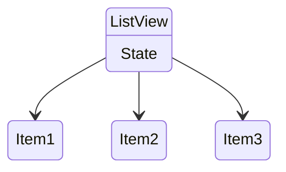
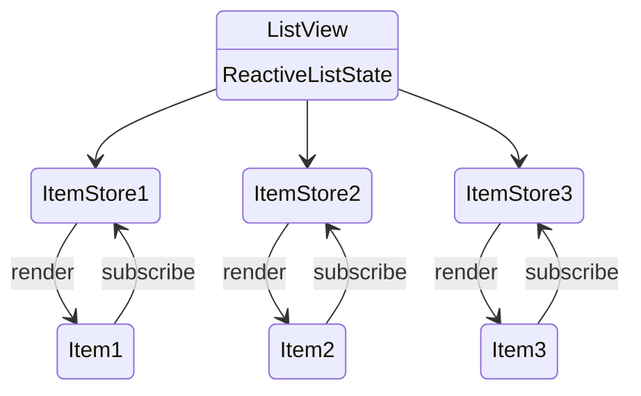

React Custom Hook - useReactiveListState
===

> 目的在render list的時候，優化update item時重繪的範圍，以達到效能最佳化

<br>

:star::star: **[Demo請點我](https://use-reactive-list-state.vercel.app/)**:star::star:

**useState** vs **useReactiveListState**


<br>

## How It Works?

### 原始 Render

一般來說我們會建立一個`array`的`state`，並用`map`的方式render出Component List

```jsx
const [list, setList] = useState([]);
```
```jsx
list.map((value, index) => 
    <Item value={value}
        onChange={(newValue) => handleUpdateItem(newValue, index)}
        onRemove={() => handleRemoveItem(index)}
    />
)
```




但當我們需要update其中一筆item的時候，會用到`setList`，而這便會使React重新render所有item，若Item內容較多或筆數較大，就會造成畫面上的卡頓

圖為用開發者工具 hightLight update的結果


這時候如果去網路上爬文，得到的答案大概會告訴你把`Item`及相關function用`useCallback`、`useMemo`包起來，而這麼做以後畫面確實有比較順暢了


:bulb: 但在我的觀點來看，`useCallback`、`useMemo`會讓react把時間花在比較每個Item有無變化上，list數量較大或比較內容較為複雜的情況下，比較時所耗的運算仍然會造成畫面的卡頓

**那有沒有方法可以使React在重繪時，只針對Item的範圍重繪?**


<br>

### Reactive Render

使用`useReactiveListState`時，則會使用該hook提供的`render`函式產生Component List

```jsx
const reactiveList = useReactiveListState<string>([]);
```
```jsx
reactiveList.render((value, index) => 
   <Item value={value}
      onChange={(newValue) => reactiveList.updateItem(newValue, index)}
      onRemove={() => reactiveList.removeItem(index)} 
   />
)
//updateItem、removeItem已由hook處理好，不需另外寫
```



hook其中的結構有使用到[rxjs](https://react-rxjs.org/)的非同步函式`Subject`，透過`reactiveList.render`取得需要render的Component並且訂閱對應的item資料，在`reactiveList.updateItem`觸發item資料更新，同時向訂閱的Component發佈重繪的指令，在，**每組資料與其Component形成獨立的交互關係，在資料變化時針對單筆資料進行重繪**


**結果**

用開發者工具的角度看，render的範圍只侷限在對應的Item了，即使Item長度到達上百筆也完全不會卡頓

